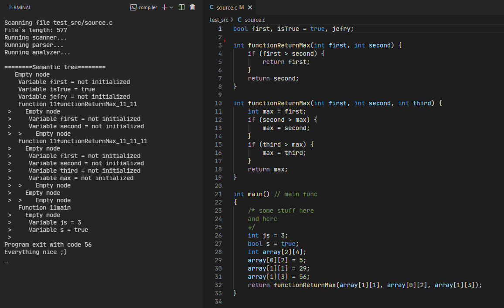

# Simple C-like language interpreter
University project of «Linguistic analysis» discipline.  

    

## Consists of:
- FileWatcher (watches for changes in source file and rerun analysis)
- Scanner (lexical analyzer)
- Parser (syntax analyzer, also interpreter itself)
- Analyzer (part of syntax analyzer)
- TreeNode (Semantic tree)

## Language support:
- Types (int, bool, void for functions)
- Two-dimensional arrays (also int, bool)
- Functions with arguments (with overloading)
- Scopes, If statements
- Logical operators (>, <, >=, <=, ==, !=)
- Basic math operators (+, -, /, *, %)
- Assignment with math operator (+=, -=, etc)
- Increment/decrement (--, ++)
- Multiple declaration on one line

The program is pretty simple and doesn't mean to have real application. Also have some architectural issues, for example, interpreter itself written in conjunction with a semantic analyzer.